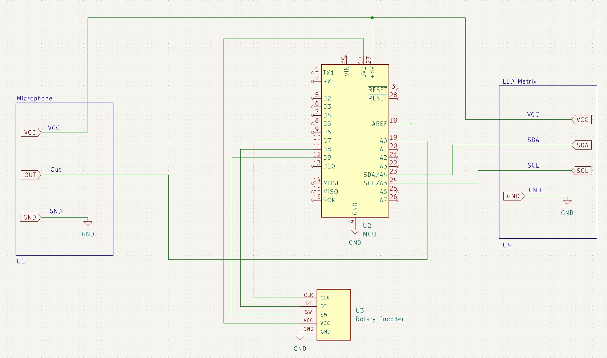
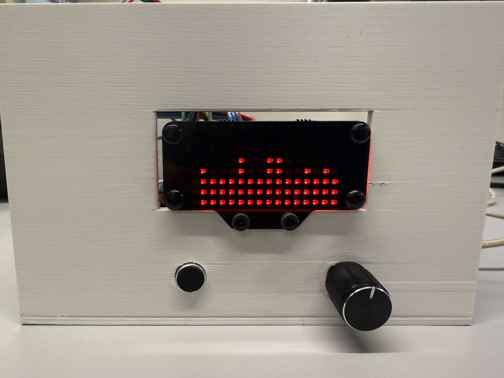
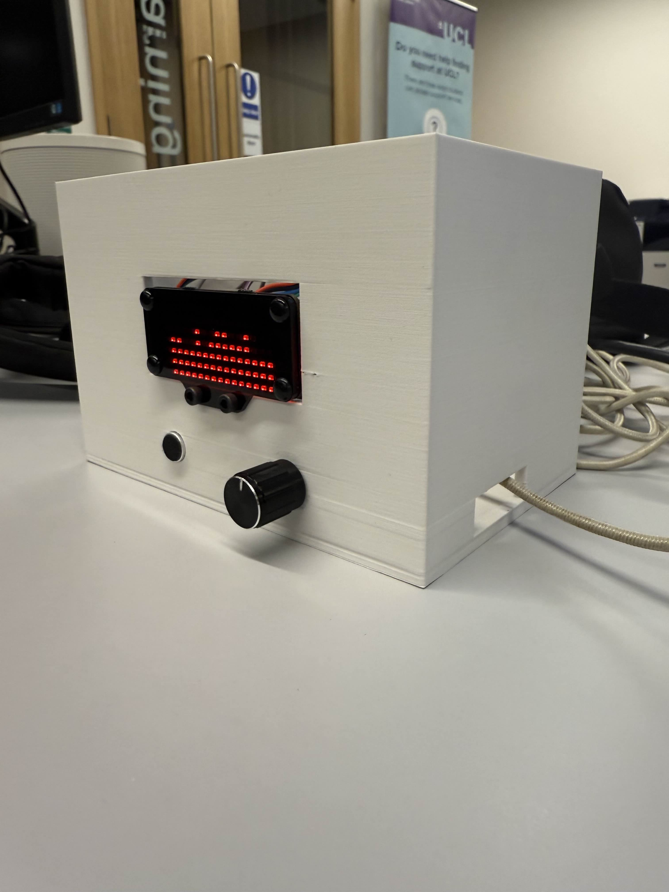
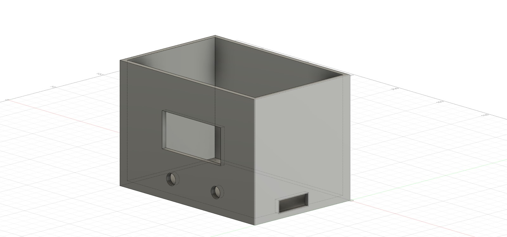

# Audio Visualizer

## Overview
The **Audio Visualizer** project is a system that transforms sound into dynamic visual representations using real-time frequency and amplitude data. This visualizer is designed as a compact, Arduino-based device that processes sound through a microphone, analyzes its frequency components using Fast Fourier Transform (FFT), and displays the data on an LED matrix.

---

## Project Aim
The goal of this project is to create an **Arduino-based audio visualizer** that utilizes FFT to display real-time frequency data from sound captured by a microphone. The visualizer focuses on simplicity, modularity, and portability, while maintaining an engaging aesthetic and accurate representation of sound signals.

---

## Features
- **Real-Time Audio Processing**: Captures audio using a microphone and visualizes frequency components.
- **Frequency Representation**: Displays a Fast Fourier Transform (FFT) of sound signals on an LED matrix.
- **Interactive Controls**: Includes a rotary encoder for adjusting the LED colors.
- **Compact and Modular Design**: Enclosed in a 3D-printed casing for portability, protection, and deployment.

---

## Hardware
### Components
- **Microphone Module**: MAX4466 - captures audio signals.
- **Rotary Encoder**: KY-040 - allows user interaction for LED colors.
- **MCU**: Arduino Nano Every - processes FFT and controls the LED matrix.
- **LED Matrix**: 8x16 RGB display - visualizes audio data.

### Circuit Schematic
Below is the schematic illustrating the connections between components:

---

## Software
### Libraries Used
- **ArduinoFFT**: Handles the Fast Fourier Transform for audio frequency analysis.
- **DFRobot_RGBPanel**: Manages the LED matrix display.
- **KY040**: Processes rotary encoder input for color adjustment.

### Code
The code is written in Arduino IDE and is available in the repository under the filename `Audio_Visualizer.ino`. It initializes the hardware components, processes audio input, and displays the FFT output dynamically.

---

## Prototype 
### Images
- **Main Prototype Front View**:
  
- **Main Prototype Side View**:
  

### Description
The prototype features a clean, functional design:
- The LED matrix is centrally positioned for optimal visibility.
- The rotary encoder and microphone are easily accessible on the front panel.
- The enclosure is designed to protect internal circuitry while maintaining portability.

---

## How to Use
1. Power the device via the Arduino Nano Every's USB port.
2. Use the rotary encoder to adjust sensitivity or switch display modes.
3. Speak or play music near the microphone and watch the LED matrix visualize the audio frequencies in real-time.

---

## Packaging
The device is housed in a 3D-printed white casing, designed for aesthetics and durability. The casing ensures the internal components are secure while allowing proper heat dissipation and visibility of the display.

Below is the designed Fusion 360 model:

---

## Credits
This project was developed as part of the **CASA0016: Making, Designing, & Building Connected Sensor Systems** course.
